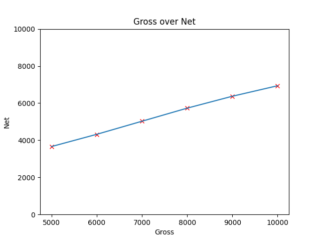

# Income calulator
Basic console application for calcualting your net income in poland in current year, using https://wynagrodzenia.pl/kalkulator-wynagrodzen (with default settings beside income value).

## USAGE:
python main.py -h:
\

\
expected outcome for: main.py 5000.00 6000.00 7000.00 8000.00 9000.00 10000.00 4000.00
\

\
expected outcome for: main.py -p 5000.00 6000.00 7000.00 8000.00 9000.00 10000.00:
\

### USAGE EXAMPLE

## COMANDS:
-h or --help: shows help message\
values: positional arrgument, can be any number of float values, and application will calcualte net income using these values, values must be separated by space for example: 5000.00 6000.00 7000.00 8000.00 9000.00 10000.00 4000.00\
-p or --plot: plot entered gross values over calcualted net income
